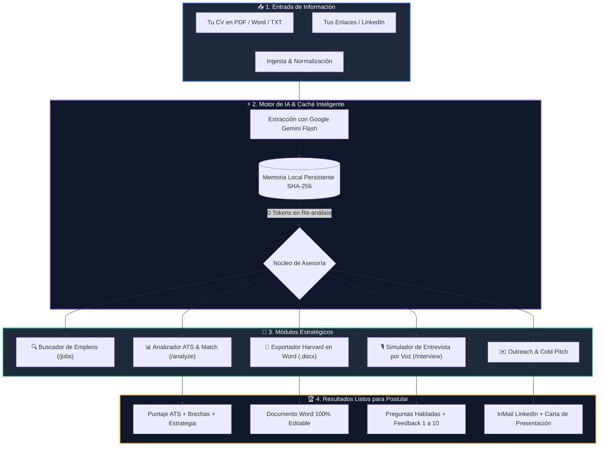

# 🚀 AI Job Advisor — Asesor Inteligente Universal de Postulaciones y Carrera

<div align="center">

-000000?style=for-the-badge&logo=nextdotjs&logoColor=white)


_Harvard_&_ATS-2B579A?style=for-the-badge&logo=microsoftword&logoColor=white)


**Tu copiloto estratégico personal y privado de carrera profesional impulsado por Inteligencia Artificial.**  
*Optimiza tu CV a formato Harvard en Word, evalúa vacantes contra filtros ATS, redacta cartas persuasivas y practica entrevistas técnicas y profesionales con voz real.*

[Explorar Características](#-capacidades-principales) • [Diagrama de Arquitectura](#-arquitectura-del-sistema) • [Instalación Rápida](#-instalación-y-uso-local) • [Licencia](#-licencia--derechos-de-autor)

</div>

---

## 💡 ¿Qué es AI Job Advisor?

**AI Job Advisor** es una plataforma de código abierto y ejecución local que transforma radicalmente el proceso de postulación laboral. A diferencia de soluciones en la nube genéricas o de pago, este sistema es **100% privado, personal y universal**: funciona en tu propio equipo, protege tus datos sensibles y está calibrado para evaluar con criterio riguroso perfiles de **cualquier profesión, ciencia o disciplina**:

- 🏛️ **Arqueología, Antropología & Patrimonio:** Prospección, excavación estratigráfica (Matriz de Harris), SIG/QGIS, fotogrametría 3D, normativa ambiental SEIA y Ley de Monumentos.
- ⚙️ **Ingenierías (Industrial, Civil, Mecánica, Eléctrica, Procesos):** Lean Manufacturing, Six Sigma, CAD/BIM, cálculo estructural, potencia y automatización.
- 💻 **Tecnología & Software:** Full Stack, arquitecturas en tiempo real, cloud, DevOps y microservicios.
- ⚖️ **Leyes, Salud, Educación y Ciencias Sociales:** Investigación aplicada, gestión legal, protocolos clínicos y metodologías cualitativas/cuantitativas.

---

## 🧠 Arquitectura del Sistema



---

## 🌟 Capacidades Principales

### 1. 🎙️ Simulador de Entrevistas Profesionales por Voz en Vivo (`/interview`)
* **Doble modalidad (Voz o Texto):**
  * **Voz por Parlantes:** Escucha a la IA formular las preguntas en voz alta de manera fluida y profesional sin consumir tokens mediante síntesis de voz nativa del navegador.
  * **Dictado por Micrófono:** Responde hablando directamente para simular la presión y espontaneidad de una llamada o videollamada real.
* **Espontaneidad y Memoria Orgánica:** La IA no lee un libreto predefinido; reacciona con repreguntas técnicas a los proyectos específicos y anécdotas que acabas de mencionar.
* **Evaluación en Tiempo Real:** Puntaje de 1 a 10, puntos fuertes detectados, debilidades metodológicas y una respuesta modelo senior recomendada.

### 2. 📄 Generador de CVs Harvard & ATS en Word 100% Editable
* **Formato Harvard Business School (.docx):** Tipografía serif clásica (Times New Roman), márgenes formales de 0.5 pulgadas, líneas separadoras sobrias y estructura cronológica invertida de alto impacto.
* **Formato Modern ATS (.docx):** Tipografía sans-serif (Calibri/Arial), espaciados milimétricos y estructura limpia para superar el 100% de los filtros algorítmicos (Workday, Greenhouse, Lever, Taleo).
* **Adaptación Dinámica por Vacante:** Inyecta automáticamente las palabras clave de la oferta y reformula viñetas bajo metodología STAR (Situación, Tarea, Acción, Resultado medible).

### 3. 📊 Analizador de Vacantes & Match Score Inteligente (`/analyze`)
* Pega cualquier oferta de empleo y recibe un diagnóstico completo:
  * **Match Score Técnico (0 - 100%):** Nivel de compatibilidad real con tu perfil.
  * **Fortalezas Clave:** Argumentos contundentes para defender tu postulación.
  * **Brechas Críticas & Cómo Mitigarlas:** Cómo justificar requisitos que no cumples al 100%.
  * **Matriz de Palabras Clave ATS:** Términos indispensables y sugeridos para tu CV.

### 4. ⚡ Cascada Automática de Modelos Gemini Flash (Tolerancia a Fallos)
* **Alta Disponibilidad sin Interrupciones:** Si una versión de Gemini alcanza límite de cuota o saturación (`429 Too Many Requests` o `RESOURCE_EXHAUSTED`), el sistema rota automáticamente en milisegundos:
  $$\text{gemini-3.8-flash} \longrightarrow \text{gemini-3.7-flash} \longrightarrow \text{gemini-3.6-flash} \longrightarrow \text{gemini-3.5-flash} \longrightarrow \text{versiones estables}$$
* Indicador visual en pantalla que transparenta qué modelo procesó la solicitud.

### 5. 🧠 Memoria Persistente Criptográfica (0 Tokens en Re-análisis)
* Motor de caché basado en hashes SHA-256 (`memory_state.json`).
* Si apagas el servidor y lo vuelves a iniciar, tu perfil, documentos y postulaciones están disponibles instantáneamente **sin costo de tokens ni demoras**.

### 6. 🔄 Control de Privacidad & Reset Total con 1 Clic
* La plataforma está configurada como un espacio personal (`data/profiles/mi-perfil/`).
* ¿Quieres empezar desde cero o compartir la computadora? El botón **"Resetear Perfil"** borra de forma segura todos tus documentos subidos, enlaces, historial de postulaciones y memoria en caché con confirmación de seguridad.

---

## 🛠️ Stack Tecnológico

| Capa | Tecnologías |
| :--- | :--- |
| **Frontend & Backend** | [Next.js 15 (App Router)](https://nextjs.org/), React 19, TypeScript |
| **Estilos & Diseño** | [Tailwind CSS](https://tailwindcss.com/), Lucide React (Dark Mode Premium) |
| **Inteligencia Artificial** | SDK Oficial [@google/genai](https://www.npmjs.com/package/@google/genai) con Cascada Flash |
| **Generación de Documentos** | [docx](https://docx.js.org/) (Estándar tipográfico Harvard & ATS) |
| **Procesamiento de Archivos** | `pdf-parse` (extracción textual) y parseo multimodal |
| **Audio & Voz** | Web Speech API (SpeechSynthesis & SpeechRecognition) con cero costo de tokens |
| **Cliente HTTP** | Axios con gestión unificada de blobs y descargas binarias |

---

## 📂 Estructura Limpia del Proyecto

```
AI Job Advisor/
├── data/
│   ├── applications.json         # Historial y seguimiento de tus postulaciones
│   └── profiles/
│       └── mi-perfil/            # Tu espacio personal de perfil y documentos
│           ├── profile.json      # Datos consolidados por la IA
│           ├── urls.json         # Enlaces públicos (LinkedIn, portafolio)
│           └── documents/        # Tus CVs y archivos subidos (PDF, Word, etc.)
├── src/
│   ├── app/                      # Rutas de Next.js (Dashboard, Analizador, Entrevistas, Perfil)
│   ├── components/               # Componentes interactivos (MockInterview, ResumeViewer, etc.)
│   ├── context/                  # ProfileContext para gestión de estado global
│   ├── lib/
│   │   ├── ai/                   # Cliente Gemini, cascada de modelos y prompts especializados
│   │   ├── applications/         # Gestor de postulaciones persistentes
│   │   ├── memory/               # Huellas SHA-256 y caché inteligente en disco
│   │   └── profiles/             # Ingesta, parseo y reseteo de perfil
│   └── types/                    # Tipado estricto de TypeScript
└── LICENSE                       # Licencia GPL-3.0 No Comercial
```

---

## ⚡ Instalación y Uso Local

### 1. Clonar el repositorio:
```bash
git clone https://github.com/tu-usuario/AI-Job-Advisor.git
cd "AI Job Advisor"
```

### 2. Instalar dependencias:
```bash
npm install
```

### 3. Configurar tu API Key de Gemini:
Crea un archivo `.env.local` en la raíz del proyecto:
```env
GEMINI_API_KEY=tu_api_key_de_gemini
```
> *Puedes obtener tu clave gratuita en [Google AI Studio](https://aistudio.google.com/).*  
> *(Nota: El sistema incluye generadores de respaldo inteligentes para que puedas explorar la interfaz completa incluso antes de configurar tu API Key).*

### 4. Iniciar el servidor local:
```bash
npm run dev
```
Abre en tu navegador: **[http://localhost:3000](http://localhost:3000)**

---

## 🎯 Guía Rápida de Uso (3 Pasos)

1. **Carga tu Perfil:** Ve a **"Mi Perfil"** o presiona **"Cargar Mi Perfil"** en la barra superior. Sube tu CV actual en PDF/Word y pega tu LinkedIn. Presiona **"Consolidar Perfil con IA"**.
2. **Analiza una Oferta:** Ve a **"Analizador"** (`/analyze`), pega el texto de una vacante que te interese y haz clic en **"Analizar Compatibilidad"**.
3. **Exporta y Practica:**
   - Descarga tu **CV Adaptado en Word (.docx)** con formato Harvard o ATS.
   - Pasa al **Simulador de Entrevista** y activa el micrófono o los parlantes para entrenar tus respuestas antes de la llamada real.

---

## 📜 Licencia & Derechos de Autor

**Autor y Creador Original**: **Diego Ignacio Sagredo Ailef**  
- **Correo Electrónico**: [sagredodhiego@gmail.com](mailto:sagredodhiego@gmail.com)  
- **LinkedIn Oficial**: [https://www.linkedin.com/in/diego-sagredo/](https://www.linkedin.com/in/diego-sagredo/)

Este proyecto está liberado bajo la licencia **GNU General Public License v3.0 (GPL-3.0)** con cláusulas particulares de autor:
1. **Sin Fines de Lucro / Prohibición de Venta**: Queda estrictamente prohibido lucrar, comercializar, vender o cobrar por este software o sus derivados sin consentimiento expreso por escrito del autor.
2. **Reconocimiento de Autoría Obligatorio**: Cualquier copia, fork o redistribución debe conservar de forma visible el crédito a Diego Ignacio Sagredo Ailef.
3. **Copyleft Estricto (Share-Alike)**: Todo trabajo derivado debe permanecer bajo esta misma licencia abierta y gratuita con código fuente accesible.

Para más detalles, consulta el archivo [LICENSE](LICENSE).
